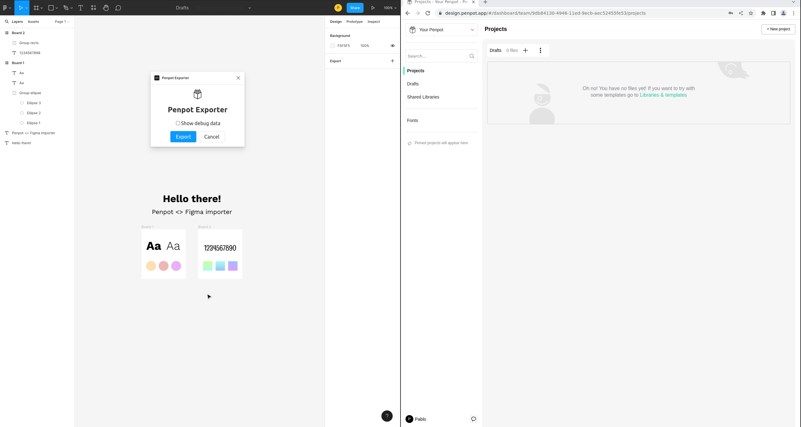

[uri_license]: https://www.mozilla.org/en-US/MPL/2.0
[uri_license_image]: https://img.shields.io/badge/MPL-2.0-blue.svg

<h1 align="center">
  <br>
  
  <br>
  PENPOT EXPORTER
</h1>

<p align="center"><a href="https://www.mozilla.org/en-US/MPL/2.0" rel="nofollow"></a>
<a href="https://tree.taiga.io/project/penpot/" title="Managed with Taiga.io" rel="nofollow"></a>
<a href="https://gitpod.io/#https://github.com/penpot/penpot" rel="nofollow"></a></p>

<p align="center">
    <a href="https://penpot.app/"><b>Penpot Website</b></a> •
    <a href="https://community.penpot.app/t/figma-file-importer/1684"><b>Export Figma to Penpot (penpot community)</b></a> •
    <a href="https://community.penpot.app/"><b>Penpot Community</b></a> •
</p>

<p align="center">
  
</p>



This is a **very early-stage** Figma plugin to export Figma files to Penpot format. For now is
little more than a proof of concept, or a first scaffolding, not a fully functional exporter.

## Table of contents

- [Table of contents](#table-of-contents)
- [Why a Penpot exporter](#why-a-penpot-exporter)
- [Getting started](#getting-started)
  - [Pre-requisites](#pre-requisites)
  - [Building](#building)
  - [Add to Figma](#add-to-figma)
  - [To use the plugin](#to-use-the-plugin)
- [Call to the community](#call-to-the-community)
- [What can this plugin currently import?](#what-can-this-plugin-currently-import)
- [Limitations](#limitations)
- [Contributing](#contributing)
- [License](#license)

## Why a Penpot exporter

The aim of this plugin is to help people migrate their files from Figma to
[Penpot](https://penpot.app/). Migrating work from one design tool to another was never an easy task
due to the abundance of closed and non-standard formats, and this is not a different case. Our
approach to better solve this situation is to release a code skeleton for the minimum version of a
Figma plugin that can convert a Figma file into a Penpot annotated SVG file.

There is a sense of urgency for this capability because there is a feeling that Adobe might force
Figma to limit exports and interoperability via plugins very soon.

## Getting started

This plugin makes use of npm, webpack and react, and is written on TypeScript. It also includes a
Penpot file builder library.

### Pre-requisites

To use this plugin, you will need to have `node` and `npm` installed on your computer. If you don't
already have these, you can download and install them from the official website
([https://nodejs.org/en/](https://nodejs.org/en/)).

Once you have `node` and `npm` installed, you will need to download the source code for this plugin.
You can do this by clicking the "Clone or download" button on the GitHub page for this project and
then selecting "Download ZIP". Extract the ZIP file to a location on your computer.

### Building

#### For Windows users:

1.  Open the terminal by searching for "Command Prompt" in the start menu.
2.  Use the `cd` command to navigate to the folder where the repository has been extracted. For
    example, if the repository is located in the `Downloads` folder, you can use the following
    command: `cd Downloads/penpot-exporter-figma-plugin`.
3.  Once you are in the correct folder, you can run the `npm install` command to install the
    dependencies, and then the `npm run build` command to build the plugin.

#### For Mac users:

1.  Open the terminal by searching for "Terminal" in the Launchpad or by using the `Command + Space`
    keyboard shortcut and searching for "Terminal".
2.  Use the `cd` command to navigate to the folder where the repository has been extracted. For
    example, if the repository is located in the `Downloads` folder, you can use the following
    command: `cd Downloads/penpot-exporter-figma-plugin`.
3.  Once you are in the correct folder, you can run the `npm install` command to install the
    dependencies, and then the `npm run build` command to build the plugin.

#### For Linux users:

1.  Open the terminal by using the `Ctrl + Alt + T` keyboard shortcut.
2.  Use the `cd` command to navigate to the folder where the repository has been extracted. For
    example, if the repository is located in the `Downloads` folder, you can use the following
    command: `cd Downloads/penpot-exporter-figma-plugin`.
3.  Once you are in the correct folder, you can run the `npm install` command to install the
    dependencies, and then the `npm run build` command to build the plugin.

### Add to Figma

`Figma menu` > `Plugins` > `Development` > `Import plugin from manifest…` To add the plugin to
Figma, open Figma and go to the `Plugins` menu. Select `Development` and then choose
`Import plugin from manifest…`.

 Development menus open showing the, "Import plugin from manifest" option.'>

Select the `manifest.json` file that is located in the folder where you extracted the source code
for the plugin.

### To use the plugin

1. Select what you want to export
2. `Figma menu` > `Plugins` > `Development` > `Penpot Exporter` go to the `Plugins` menu in Figma
   and select `Development` followed by `Penpot Exporter`.
3. This will generate a .zip file that you can import into Penpot.

## Call to the community

Answering to the interest expressed by community members to build the plugin by themselves, at the
Penpot team we decided to help solve the need without having to depend on our current product
priorities. That is why we have published this bare minimum version of the plugin, unsatisfactory in
itself, but it unlocks the possibility for others to continue the task.

Yes, we are asking for help. 🤗

We have explained this approach in a
[community post](https://community.penpot.app/t/figma-file-importer/1684). Feel free to join the
conversation there.

## What can this plugin currently import?

As mentioned above, this plugin gets you to a starting point. Things that are currently included in
the import are:

- **Basic shapes** (rectangles, ellipses).
- **Frames** (Boards in Penpot).
- **Groups**.
- **Fills** (solid colors and linear gradients).
- **Texts** (basic support. Only fonts available on Google fonts).
- **Images** (basic support)

## Limitations

The obvious limitations are the features that are in Figma but not in Penpot or work differently in
both tools so they can not be easily converted. We leave some comments below about the ones that are
commonly considered more important:

- **Autolayout**: Not in Penpot yet but in a very advanced state of development. There will be news
  soon.
- **Components**: Currently very different from their counterparts at Figma. However, Penpot
  components are under a rework that we expect will make the conversion easier.
- **Variants**: Not expected in the short term. Also, we are thinking of different solutions to
  solve component states, things that eventually could make it difficult to import.

## Contributing

If you want to make many people very happy and help us build this code skeleton for the minimum
version of the Figma plugin, a further effort will be needed to have a satisfactory import
experience.

For instance, it will be interesting to add:

- Strokes
- Fills with radial gradients
- Paths
- Images (full support)
- Texts (full support)
- Rotations
- Constraints
- ...

Motivated to contribute? Take a look at our
[Contributing Guide](https://help.penpot.app/contributing-guide/) that explains our guidelines
(they're for the Penpot Core, but are mostly of application here too).

## License

```
This Source Code Form is subject to the terms of the Mozilla Public
License, v. 2.0. If a copy of the MPL was not distributed with this
file, You can obtain one at http://mozilla.org/MPL/2.0/.

Copyright (c) KALEIDOS INC
```

Penpot and the Penpot exporter plugin are Kaleidos’
[open source projects](https://kaleidos.net/products)
